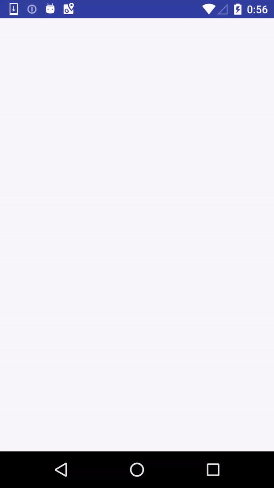

TrafficMonitor

# About
Display traffic per Activity.Observing traffic is used by `TrafficStats` API.
OkHttp Interceptor observer is implementing.

# Demo
## Baisis


## `TrafficMonitor.snap`
Use `TrafficMonitor.snap` to dump traffic from before execute to logcat.

For example
```
adb logcat -s TrafficMonitor
06-04 00:56:52.049 18147 18147 D TrafficMonitor: Fragment:1:Fragment:1:
06-04 00:56:52.049 18147 18147 D TrafficMonitor: 0B
06-04 00:56:52.049 18147 18147 D TrafficMonitor: 11.28KB
06-04 00:57:02.174 18147 18147 D TrafficMonitor: Fragment:2:Fragment:2:
06-04 00:57:02.174 18147 18147 D TrafficMonitor: 0B
06-04 00:57:02.174 18147 18147 D TrafficMonitor: 10.82KB
```

# Usage
## Basis
Implement at in your  `Application` class.

```kotlin
  class App: Application() {
    override fun onCreate() {
      super.onCreate()
      if (Build.VERSION.SDK_INT >= Build.VERSION_CODES.M) {
        if (Settings.canDrawOverlays(this)) {
          val config = DisplayConfig(WindowManager.LayoutParams.TYPE_SYSTEM_ALERT, DisplayPosition.BOTTOM_RIGHT)
          TrafficMonitor.startMonitoring(this, config)
        }
      } else {
        TrafficMonitor.startMonitoring(this)
      }
    }

    override fun onTerminate() {
      TrafficMonitor.stopMonitoring(this)
      super.onTerminate()
    }
```

## snapshot
observe not per Activity, use `TrafficMonitor.snap`.

## TODO

- [ ] Observe by OkHttpIntercpeter

# License

```text
Copyright 2017 Tetsuya Masuda

Licensed under the Apache License, Version 2.0 (the "License");
you may not use this file except in compliance with the License.
You may obtain a copy of the License at

   http://www.apache.org/licenses/LICENSE-2.0

Unless required by applicable law or agreed to in writing, software
distributed under the License is distributed on an "AS IS" BASIS,
WITHOUT WARRANTIES OR CONDITIONS OF ANY KIND, either express or implied.
See the License for the specific language governing permissions and
limitations under the License.
```
